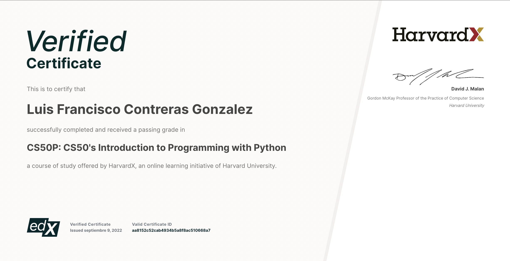
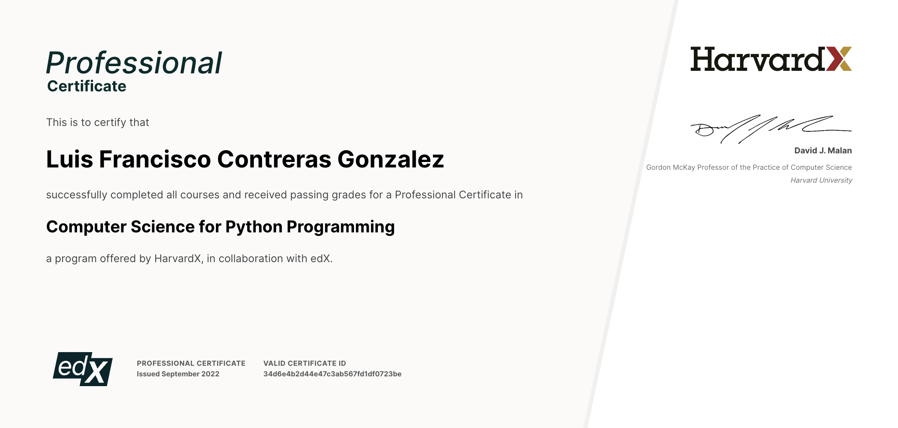

# Harvard University CS50's Introduction to Programming with Python.

This project contains the problem sets for Harvard University CS50's Introduction to Programming with Python.

Topics include:

- Functions, Variables
- Conditionals
- Loops
- Exceptions
- Libraries
- Unit Tests
- File I/O
- Regular Expressions
- Object-Oriented Programming
- Final Project

Verified certificate from Harvard University and Edx:

Complete Computer Science for Python Programming certificate for finishing CS50 and CS50P 18 problem sets and 2 final projects:

For more certifications and complete profile please check my LinkedIn: https://www.linkedin.com/in/luis-francisco-contreras-gonzalez-45791715a/
